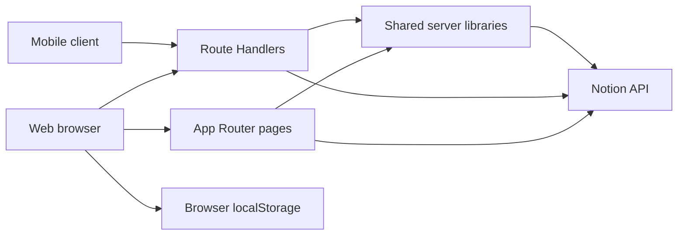

# Architecture

**Document status:** Living description of current architecture  
**Last verified:** 2026-07-16

## Overview

Spartan Command Center is a single Next.js 16 application using the App Router under `src/app`. It combines Server Components, Client Components, Route Handlers, static assets, and direct server-side Notion SDK calls.

The diagram describes current connections, not desired security or persistence boundaries.

## Route structure

- `src/app/page.tsx` exposes the public login page through `LoginPage`.
- `src/app/(protected)/layout.tsx` wraps eight protected page routes through `ProtectedLayout`.
- `src/app/api/**/route.ts` exposes 21 HTTP endpoints.
- `src/app/components` contains shared presentation and interactive components.
- `src/lib` contains shared Notion, achievement, event, and date logic.
- `src/data/events.ts` is the repository-owned event catalog.
- `public/images` contains portraits, HUD backgrounds, event art, and achievement patches.

The `(protected)` route group organizes pages without changing their URLs, consistent with App Router route-group behavior.

## Rendering boundaries

### Server Components

`CommandHudPage` in `src/app/(protected)/command-hud/page.tsx` and `Home` in `src/app/(protected)/service-record/page.tsx` execute server-side and call Notion directly. Both export `dynamic = "force-dynamic"` and `revalidate = 0`.

`ProtectedLayout` awaits `cookies()` and redirects requests that lack the expected cookie value.

### Client Components

The Medical Unit, Intel Reports, and Training Reports pages declare `"use client"` and fetch Route Handlers after rendering. `EventSystem`, `HudCheckbox`, and `NavBar` are also Client Components because they use browser storage, state, navigation hooks, or event handlers.

The repository currently has no `loading.tsx` or `error.tsx` boundaries.

## Data access

[ADR-0001](adr/0001-notion-as-operational-data-store.md) records Notion as the current operational data store.

Notion client construction is centralized:

- `getNotionClient` in `src/lib/notion-client.ts` lazily initializes the only production `Client` instance, validates `NOTION_TOKEN` on first use, and is protected by `server-only`.
- `src/lib/notion.ts` owns shared Service Record, Daily SITREP, hydration-total, Service History, workout, and Weekly Operations helpers.
- Server Components, Route Handlers, and `src/lib/achievements.ts` obtain the SDK through the shared accessor rather than constructing module-local clients.
- Route-specific queries remain close to their domains, while required identifier lookup produces explicit missing-configuration errors.

Schema mapping, pagination, authorization, and error translation are still distributed technical debt; ticket #11 centralizes the client and the duplicated domain operations without claiming that the full data-access layer is complete.

## Main request flows

### Daily objective update

1. `CommandHudPage` reads the current SITREP through `getTodaySitrep`.
2. `HudCheckbox.toggle` sends `propertyName` and `checked` to `/api/sitrep-checkbox`.
3. The Route Handler calls `updateDailySitrepCheckbox`.
4. Checked objectives trigger `evaluateAchievements`.
5. The client calls `router.refresh()` without verifying `response.ok`.

### Hydration update

1. `TrainingReportsPage.submitHydration` posts an amount to `/api/hydration-log`.
2. The Route Handler creates a Notion Hydration Log page.
3. It aggregates the current America/Denver operational day through `getHydrationTotalForOperationalDay`, using DST-safe UTC query boundaries from `src/lib/date.ts`.
4. At 96 ounces, it updates the current Denver-dated SITREP Water checkbox.
5. The page reloads `/api/hydration-total`.

Daily record selection and hydration aggregation now share the America/Denver operational calendar accepted in [ADR-0003](adr/0003-denver-operational-time.md).

### Workout update

1. `TrainingReportsPage.submitWorkout` sends controlled workout fields to `/api/workout-log`.
2. The Route Handler verifies the current session, validates category, duration, distance, RPE, and notes, then creates the Notion Workout Log record.
3. After a successful write, the page refreshes the authenticated weekly workout count and phase totals.
4. Phase hydration and workout totals derive their start date from the active campaign's authoritative campaign day rather than a repository date constant.

### Event completion

1. `EventSystem` derives the active event from `eventCatalog` and browser-local completed IDs.
2. As an interim fallback for SDCB #187, the browser immediately adds the event ID to local state and `localStorage` so a failed backend request does not block local completion.
3. It makes a best-effort post of client-supplied event metadata to `/api/complete-event`.
4. When the request succeeds, the Route Handler optionally resolves Event and Service Record relations and calls the shared `createServiceHistoryEntry` helper to create a Service History page in Notion.
5. A failed request is logged but does not roll back browser-local completion. Backend history, rewards, and cross-device completion remain unresolved.

### Academic assignment flow

1. `MedicalUnitPage` calls `/api/smu/orders` and `/api/smu/pipeline`.
2. Route Handlers query the Assignments data source.
3. The orders endpoint returns focus, due-soon, and critical groups.
4. The pipeline endpoint paginates all assignments and calculates per-course totals.
5. `/api/smu/orders/complete` updates an assignment Status to Complete.

## Security boundary

Every Route Handler is a public HTTP entry point and must verify authorization independently. The workout logging and phase-metric handlers use `hasAuthorizedSession`; many older handlers remain unguarded. The current `ProtectedLayout` protects page rendering only. `proxy.disabled.ts` is disabled by filename and would still not replace authorization checks if enabled.

The current static cookie implementation and unguarded Route Handlers are tracked by [SDCB #192](https://app.notion.com/p/39cbc7d80f45818293afd11fc4c17bae).

## Persistence boundaries

| Data | Current persistence |
| --- | --- |
| SITREP, weekly operations, hydration, assignments, achievements, books, reading reports, service history | Notion |
| Event completion IDs | Browser `localStorage` |
| Mobile hydration | Server-process memory |
| Mobile intel reports | Not persisted |
| Static campaign, promotion, Armory, recommendations, and several SMU values | Repository constants or placeholder JSX |

## Deployment assumptions

The repository contains no deployment configuration beyond standard Next.js defaults and ignored `.vercel` state. `next.config.ts` has no custom options. Deployment on Vercel is implied by repository history and environment terminology, but operational deployment procedures are not yet documented in Phase 1.

## Architectural direction

Near-term direction is to secure entry points, centralize durable data behavior, standardize operational time, define API contracts, and add tests before expanding integrations. Planned and proposed work is kept in [`ROADMAP.md`](ROADMAP.md), not asserted here as current architecture.
