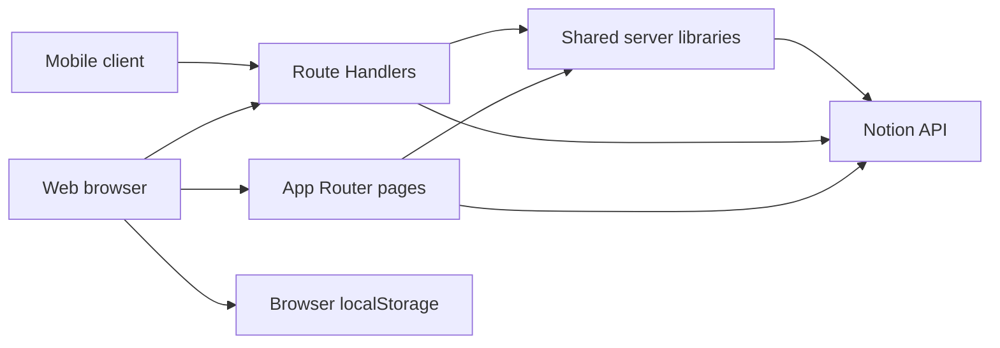

# Architecture

**Document status:** Living description of current architecture  
**Last verified:** 2026-07-26

## Overview

Spartan Command Center is a single Next.js 16 application using the App Router under `src/app`. It combines Server Components, Client Components, Route Handlers, static assets, and direct server-side Notion SDK calls.

```mermaid
flowchart LR
    Browser["Web browser"]
    Mobile["Mobile client"]
    Pages["App Router pages"]
    Routes["Route Handlers"]
    Lib["Shared server libraries"]
    Notion["Notion API"]
    Storage["Browser localStorage"]

    Browser --> Pages
    Browser --> Routes
    Mobile --> Routes
    Pages --> Lib
    Pages --> Notion
    Routes --> Lib
    Routes --> Notion
    Lib --> Notion
    Browser --> Storage
```

The diagram describes current connections, not desired security or persistence boundaries.

## Route structure

- `src/app/page.tsx` exposes the public login page through `LoginPage`.
- `src/app/(protected)/layout.tsx` wraps 11 protected page routes through `ProtectedLayout`.
- `src/app/api/**/route.ts` exposes 28 Route Handler files.
- `src/app/components` contains shared presentation and interactive components.
- `src/lib` contains shared Notion, achievement, event, and date logic.
- `src/data/events.ts` is the repository-owned event catalog.
- `public/images` contains portraits, HUD backgrounds, event art, and achievement patches.

The `(protected)` route group organizes pages without changing their URLs, consistent with App Router route-group behavior.

## Rendering boundaries

### Server Components

`CommandHudPage` in `src/app/(protected)/command-hud/page.tsx` and `Home` in `src/app/(protected)/service-record/page.tsx` execute server-side and call Notion directly. Both export `dynamic = "force-dynamic"` and `revalidate = 0`.

`ProtectedLayout` calls the centralized, server-only `hasAuthorizedSession` verifier and redirects requests that lack an authentic, unexpired signed session.

### Client Components

The Medical Unit, Intel Reports, and Training Reports pages declare `"use client"` and fetch Route Handlers after rendering. `EventSystem`, `HudCheckbox`, and `NavBar` are also Client Components because they use state, navigation hooks, or event handlers.

The repository currently has no `loading.tsx` or `error.tsx` boundaries.

## Data access

[ADR-0001](adr/0001-notion-as-operational-data-store.md) records Notion as the current operational data store.

Notion client construction is centralized:

- `getNotionClient` in `src/lib/notion-client.ts` lazily initializes the only production `Client` instance, validates `NOTION_TOKEN` on first use, and is protected by `server-only`.
- `src/lib/notion.ts` owns shared Service Record, Daily SITREP, hydration-total, Service History, workout, and Weekly Operations helpers.
- Server Components, Route Handlers, and `src/lib/achievements.ts` obtain the SDK through the shared accessor rather than constructing module-local clients.
- Route-specific queries remain close to their domains, while required identifier lookup produces explicit missing-configuration errors.

Schema mapping, pagination, and error translation remain distributed technical debt. Authorization is centralized through `src/lib/auth.ts`, and every private Route Handler verifies the signed session before reading or mutating Notion.

Intel Report submission uses the shared absolute-ending-page contract in
`src/lib/intel-report.ts`. `POST /api/intel-reports` verifies the selected page
belongs to the configured Archive data source, derives the book title and page
delta from that authoritative record, and validates the ending page against
Current Page and Total Pages. Reading Reports use a deterministic
Book-plus-ending-page title: a retry can detect a report created before an
interrupted Archive update and finish the update without adding another normal
report. This is application-level reconciliation rather than a transactional or
distributed uniqueness guarantee; the limitation remains governed by
[ADR-0001](adr/0001-notion-as-operational-data-store.md).

Intel material reads use the shared selection contract in
`src/lib/archive-materials.ts`. `GET /api/intel-books` follows every Notion
pagination cursor before partitioning records: Active titles feed Active
Materials, while Low Priority, Medium Priority, High Priority, and Wishlist
titles are recommendation-eligible. The server sorts eligible records by
descending Fit Score with a title tie-break, then returns the deduplicated union
of every eligible Priority Band record and at most five highest-Fit-Score
records. Complete and Active titles cannot appear in the recommendation result.
The same route follows every Reading Reports cursor and reduces Book relations to
their latest Date. Active Material cards receive that nullable timestamp and
re-fetch it together with Archive progress after a successful report.

Reading Reports configuration accepts either the parent database ID or the
underlying data-source ID. `src/lib/notion-data-source.ts` verifies a configured
data-source ID directly and falls back to resolving the first source from a
database ID, keeping both Intel routes on the same Notion API contract.

## Authentication and authorization

[ADR-0008](adr/0008-signed-single-user-sessions.md) records the current single-user session boundary.

1. `POST /api/login` validates the ALEX-225 designation and server-held `SITE_PASSWORD`, then signs a versioned seven-day token with the production `SESSION_SECRET`.
2. The response stores the token in the `scp_session` cookie with `HttpOnly`, production `Secure`, `SameSite=Strict`, path `/`, and high-priority attributes. It deletes the retired `scp_auth` cookie.
3. `hasAuthorizedSession` reads the cookie through the asynchronous Next.js `cookies()` API and rejects malformed, tampered, wrong-secret, expired, future-dated, or wrong-subject tokens.
4. `ProtectedLayout` applies that verifier to all protected pages. Every private Route Handler applies the same verifier independently because layouts do not authorize Route Handlers.
5. `POST /api/logout` deletes both current and legacy authentication cookies. Login and logout are the only public Route Handlers.
6. Production fails closed if a dedicated `SESSION_SECRET` of at least 32 bytes is unavailable. Local development may derive a development-only key from `SITE_PASSWORD`.

## Main request flows

### Daily objective update

1. `CommandHudPage` reads the current SITREP through `getTodaySitrep`.
2. `HudCheckbox.toggle` sends `propertyName` and `checked` to `/api/sitrep-checkbox`.
3. The Route Handler calls `updateDailySitrepCheckbox`, which persists the source checkbox and reconciles the source-derived Unit Cohesion operation when permanent Fireteam assignment is complete and the record is assignment-date eligible.
4. For a checked objective, the handler registers `scheduleAchievementEvaluation` with Next.js `after()` and returns the successful save response without waiting for achievement work. Daily SITREP, Weekly Operations, and mobile objective routes share this contract and expose `achievementEvaluation: "scheduled"` while preserving an empty `awarded` array for response compatibility.
5. A successful or idempotently recovered Intel Report submission uses the same Daily SITREP updater to check the canonical `Read` objective, reconcile eligible Unit Cohesion evidence, and schedule achievement evaluation after the response.
5. The post-response callback runs for up to the route's configured 60-second duration. A module-level single-flight coordinator coalesces overlapping requests in the same server process, logs failures without changing the already-durable habit mutation, and releases after success or failure so a later request can recover.
6. `evaluateAchievements` uses `collectNotionPages` to follow every `has_more` / `next_cursor` response for earned and unearned definitions plus daily or weekly completion evidence. After dating a newly earned definition, it re-reads the formula-derived readiness award and reconciles one relation-backed Service History ledger row with a stable readiness operation ID. Every evaluation also repairs an earned achievement whose prior history write was interrupted; duplicate histories block reconciliation.
7. The client receives the save response, clears its `Saving...` state, and refreshes server data. Achievement presentation can therefore appear on the next refresh without delaying checkbox feedback.

### Hydration update

1. `TrainingReportsPage.submitHydration` posts an amount to `/api/hydration-log`.
2. The Route Handler creates a Notion Hydration Log page.
3. It aggregates the current America/Denver operational day through `getHydrationTotalForOperationalDay`, using DST-safe UTC query boundaries from `src/lib/date.ts`.
4. At 96 ounces, it updates the current Denver-dated SITREP Water checkbox through the shared mutation helper, including eligible Unit Cohesion reconciliation.
5. The page reloads `/api/hydration-total`.

Daily record selection and hydration aggregation now share the America/Denver operational calendar accepted in [ADR-0003](adr/0003-denver-operational-time.md).

### Workout update

1. `TrainingReportsPage.submitWorkout` sends controlled workout fields to `/api/workout-log`.
2. The Route Handler verifies the current session, validates category, duration, distance, RPE, and notes, then creates the Notion Workout Log record.
3. After a successful write, the page refreshes the authenticated weekly workout count and phase totals.
4. Phase hydration and workout totals derive their start date from the active campaign's authoritative campaign day rather than a repository date constant.

### Event completion

1. `getActiveCampaignEventState` loads Event records from Notion, resolves their related Campaign Operations phase records, and returns the active campaign name, phase name, next phase name, phase length, schedule, and authoritative campaign day. Event records without a legacy `Event ID` use their stable Notion page ID for application identity, while completion is derived directly from the resolved record and linked history.
2. `EventSystem` loads that server-derived state from `/api/events/status`. `getEventOutcomeState` distinguishes upcoming, active, past-due incomplete, failed cooldown, retry-ready, terminal failed, and completed outcomes from the authoritative campaign day plus persisted Event fields.
3. Authenticated `/api/complete-event` accepts only an event identifier; it rejects events outside the active phase, events before their scheduled campaign day, and later events while an earlier one is unresolved. The exact Notion page ID resolved from the active phase is retrieved before any legacy Event ID lookup, preventing a stale same-ID row from replacing the active record.
4. Before readiness evaluation, the Route Handler enforces the Event's persisted `Retry Available Day`. The review UI and Route Handler consume the same typed requirements resolved from the active phase's Notion Event row. `evaluateEventReadiness` returns category-specific minimum failures and an optional at-least-one failure with the observed score evidence. An unsuccessful review returns that structured evaluation, writes `Failed`, and attempts to consume the next Notion-owned five-day retry slot without creating completion history, XP, standings, or phase progress. `Retry Slots Used` shifts the failed Event and every later Event together, so a retry is authorized only when the complete remaining schedule still fits inside the phase. Without that reserve capacity, the retry day is persisted as null and the result is terminal.
5. On Phase II success, the server snapshots readiness and persists one deterministic Fireteam Standings resolution before reconciling exactly one XP-bearing Event Service History record and finally writing the Event record as `Defeated` with a Denver date key.
6. Standings preserve Epsilon's readiness-earned score, assign the four remaining unique values through seeded weighted rival ordering, persist cumulative totals and wins, and rank cumulative ties by wins then final-major placement. The seed and arithmetic remain server-side.
7. Event and standings writes use exact-record recovery and in-process concurrency coalescing. Retries return or repair the persisted resolution; duplicate records surface as conflicts instead of rerolling.
8. Successful completion clears the retry day. Failed, retry-ready, and terminal-failed presentation survives refresh, past-due events remain incomplete and actionable, cooldown copy never renders zero or negative days, and a phase with every authoritative event completed renders `All Events Complete for This Phase`.
9. Legacy catalog entries remain presentation fallbacks for event copy and artwork while scheduling, readiness requirements, retry policy, phase scope, and completion state come from Notion.

### Campaign phase rollover

1. Authenticated `GET /api/campaign/rollover` discovers Campaign Operations through authoritative Event relations and selects only the immediate, same-campaign next phase whose Denver start date is due.
2. `evaluateRollover` in `src/lib/campaign-rollover.ts` blocks an outgoing phase with no events or any event lacking `Defeated`, a completion date, or linked Service History.
3. Authenticated `POST /api/campaign/rollover` is the explicit mutation boundary. HUD and page reads do not cause rollover writes.
4. Before changing phase status, the operation calculates exact phase-scoped Daily SITREP, Weekly Operations, and linked Service History event XP. It expands the phase's per-day and per-week objective pools across its length, calculates thresholds from maximum habit XP plus mandatory event XP, and writes a versioned immutable result to the outgoing Campaign Operations row.
5. A missing or duplicate linked event-history record blocks the snapshot. Once `Phase Finalized At` exists, retries read and verify the existing snapshot rather than recalculating or overwriting it.
6. The operation then reconciles exactly one phase-completion Campaign history record, blocks duplicate transition histories, writes the outgoing phase Complete, writes the incoming phase Active, and re-reads the authoritative records.
7. After rollover verifies, it persists and verifies the Service Record's Individual completion eligibility. Retries resume snapshot-only, history-only, source-only, target-only, or eligibility-only partial states.
8. A module-level promise coalesces concurrent requests in one server process; cross-process exclusivity remains constrained by Notion's lack of transactions and unique constraints.

Operational inspection and recovery are documented in [`CAMPAIGN_ROLLOVER_RUNBOOK.md`](CAMPAIGN_ROLLOVER_RUNBOOK.md).

### Individual completion eligibility

1. Authenticated `GET /api/progression/individual-completion` evaluates Campaign 1 Phase 1 against the current America/Denver operational date without mutation.
2. `evaluateIndividualCompletion` in `src/lib/individual-completion.ts` requires the phase completion boundary, at least one authoritative event, durable completion of every event, and exactly one XP-bearing Service History record per event.
3. Passing those checks without a frozen XP snapshot produces `ready_to_finalize`. This makes the ceremony available without silently freezing XP during a read.
4. A verified frozen snapshot produces `eligible`; only that state can be consumed by the later canonical Fireteam assignment workflow. A persisted `Eligible` label cannot substitute for missing evidence.
5. Authenticated `POST /api/progression/individual-completion` explicitly reconciles the versioned status, evidence explanation, evaluation date, source Campaign relation, and completion date on ALEX-225's Service Record.
6. `Assigned` or a `Fireteam Member` progression stage is terminal. The evaluator reports the completed transition but does not create or choose the Fireteam assignment; that remains a separate Phase II workflow.

### Ceremonial events and the Assembly Hall

1. `getCeremonialEvent` and `getPromotionCeremonialEvent` in `src/lib/ceremonial-events.ts` translate authoritative assignment or promotion states into presentation-only Personnel Command orders. Fireteam Assignment and Promotion orders remain visible through interrupted history finalization; a Promotion order first appears when the durable awarded rank is below an XP-earned conventional threshold.
2. A Ceremonial Event is not a Campaign Event. Its contract explicitly carries zero XP, readiness, and standings rewards and routes to `/assembly-hall`; later medal, command-assignment, specialization, and graduation eligibility may use the same order shape.
3. `CommandHudPage` evaluates Fireteam Assignment and Promotion status on the server and passes the highest-priority resulting order to `EventSystem`. A due Campaign Event retains presentation priority; otherwise the ceremonial order occupies the same right-side event slot and links directly to the hall.
4. `/assembly-hall` is a dynamic Server Component that renders the permanent location from live eligibility and assignment evidence. `FireteamAssignmentCeremony` begins the ceremony, advances four monotonic persisted presentation steps, accepts the assignment, presents recovery when finalization is incomplete, and offers a read-only replay after completion.
5. Beginning the ceremony is an explicit mutation. It freezes and verifies the Phase I XP/medal snapshot when eligibility is `ready_to_finalize`, reconciles eligibility to `eligible`, and then writes `In Progress`; ordinary reads never freeze XP.
6. The authenticated `/api/progression/fireteam-assignment` Route Handler accepts only `begin`, `progress`, or `complete`. The server owns Fireteam Epsilon's ID, name, motto, five stable member IDs, assignment version, operation ID, roster snapshot, and initial `Acquaintance I` teammate baselines; the client cannot submit or reroll identity.
7. Completion first writes the canonical assignment to ALEX-225's Service Record with status `Finalizing` and progression stage `Fireteam Member`, then finds or creates the exact zero-reward `Assignment` Service History record, requires exactly one matching record, and finally marks the assignment `Complete`. A retry resumes from the persisted step or reconciles the canonical finalizing snapshot rather than creating a second identity.
8. `/fireteam` is always routable but keeps identity and dossiers restricted until assignment state is `completed`. The completed surface reads the same canonical contract used by the ceremony.
9. `/promotion-board` permanently redirects to the canonical Assembly Hall route, and primary navigation uses the new name.
10. `getPromotionStatus` resolves the Rank Progression data source through the Service Record's `Current Rank` relation, treats that relation as the awarded-rank authority, and validates both current and target records against the repository-owned Recruit-through-Diamond-VI contract. The `Calculated Rank` formula does not prove ceremony completion.
11. Authenticated `GET /api/progression/promotion` is read-only. It also verifies the exact prior-to-current Promotion history for every awarded conventional rank above Recruit. A missing row produces recoverable `finalizing`; duplicates or malformed evidence produce `conflict`.
12. `POST` requires the exact prior/current rank page IDs from a recovery order or current/target IDs from a new order, rechecks XP eligibility, advances at most one rank relation, and reconciles exactly one zero-reward `Promotion` Service History row linked to ALEX-225. The title and description preserve both ranks and the row date is the durable ceremony-completion date. The HUD summons clears only after both records verify; stale orders block and exact retries return the existing transition.
13. A keyed module-level promise coalesces identical in-process promotion requests. Notion still cannot enforce a distributed unique constraint, so duplicate history evidence blocks further progression for explicit reconciliation.

### Personnel insignia

1. `src/lib/personnel-insignia.ts` owns canonical Fireteam patch paths, the implemented personnel-insignia catalog, and fail-closed lookup behavior.
2. Fireteam Epsilon ownership is derived only from a completed canonical Fireteam Assignment whose persisted identity is `fireteam-epsilon`; an asset file by itself is not award evidence.
3. The exact Assignment Service History title resolves to the same catalog entry, linking the player-facing history display to durable award evidence.
4. `PageHeader` accepts an ordered list of awarded personnel insignia and omits those slots when no verified award exists. The completed Fireteam page and Assembly Hall supply the current evidence-backed list; the responsive cluster already supports later multiple-insignia additions.
5. Ceremony, Fireteam identity, standings, and Service History presentation consume the shared catalog or Fireteam patch map instead of duplicating public paths.
6. Command, specialization, campaign, and operational insignia remain phase-owned planned extensions until their authoritative persistence contracts exist.

Daily SITREP and Weekly Operations rows remain operational evidence rather than
player-facing Service History entries. Their record-worthy milestones enter the
permanent timeline through the exact Achievement history contract; this avoids
duplicating habit XP or flooding the timeline with ordinary checkbox activity.
`SERVICE_HISTORY_FILTERS`, `parseServiceHistoryFilter`, and
`matchesServiceHistoryFilter` in `src/lib/service-history-view.ts` own the
player-facing timeline classification. The server-rendered page derives filter
counts from the complete paginated result and uses URL-backed filters for
Campaigns, Events, Achievements, Promotions, Assignments, Readiness, and Other
Records. Unknown future entry types remain visible under Other Records rather
than being dropped.

### Unit Cohesion relationship progression

1. `src/lib/unit-cohesion.ts` owns the approved Daily SITREP and Weekly Operations affinity map, stable operation-ID contract, sixteen-level 25/50/75/100 curve, source-date eligibility rule, and deterministic ledger aggregation.
2. Qualifying source mutations persist the source checkbox first, then reconcile one `System` Service History row whose title is derived from source type, source record ID, and property. The JSON description records the source, member, readiness category, active/reversed state, and update time; XP remains zero.
3. Permanent Fireteam assignment is the eligibility boundary. Pre-assignment source dates do not create ledger rows, and a false checkbox with no prior row is a no-op.
4. Repeated writes with the same state are idempotent. Unchecking updates the exact row to inactive; rechecking restores it to active rather than creating a new point.
5. `getUnitCohesionStatus` derives each teammate's current total and current-level progress from active ledger rows. Duplicate source operations are surfaced as reconciliation conflicts instead of silently double-counted.
6. `/fireteam` reads the derived state only after canonical assignment completion. Unit Cohesion `System` rows are excluded from the player-facing Service History timeline.
7. In-process promises coalesce simultaneous writes to one operation. Cross-process uniqueness remains constrained by Notion; exact-record queries and duplicate detection provide recovery evidence rather than transactional guarantees.

### Academic assignment flow

1. `MedicalUnitPage` calls `/api/smu/orders` and `/api/smu/pipeline`.
2. Route Handlers query the Assignments data source.
3. The orders endpoint returns focus, due-soon, and critical groups.
4. The pipeline endpoint paginates all assignments and calculates per-course required and optional completion, remaining weekly minutes, overdue work, skipped work, and the next exam.
5. The authenticated quarter endpoint reads the active and up-next records from the Notion Quarters data source.
6. `/api/smu/orders/complete` updates an assignment Status to Complete.

## Security boundary

Every Route Handler is a public HTTP entry point and must verify authorization
independently. Every current private handler calls `hasAuthorizedSession`; the
authorization regression suite enumerates the Route Handler tree and fails if a
private entry point omits that boundary. `/api/login` and `/api/logout` are the
only public handlers. `ProtectedLayout` protects page rendering only, and
`proxy.disabled.ts` is disabled by filename; neither substitutes for
Route Handler authorization.

The signed-session and private-handler boundary was implemented under
[SDCB #192](https://app.notion.com/p/39cbc7d80f45818293afd11fc4c17bae)
and is recorded in [ADR-0008](adr/0008-signed-single-user-sessions.md).

## Persistence boundaries

| Data | Current persistence |
| --- | --- |
| SITREP, weekly operations, hydration, assignments, achievements, books, reading reports, service history | Notion |
| Event completion state | Notion Events and linked Service History records |
| Fireteam Standings | One zero-XP `System` Service History resolution per competitive event stores the readiness snapshot, deterministic seed/version, five unique scores and placements, cumulative totals, wins, and final-major tie-break evidence; it deliberately has no Related Event relation so XP/history uniqueness remains separate |
| Campaign phase rollover | Versioned final XP/medal snapshot and phase states on Notion Campaign Operations, plus one linked Service History Campaign record |
| Individual completion eligibility | Versioned eligibility status, source phase, evidence explanation, evaluation date, and completion date on ALEX-225's Notion Service Record |
| Fireteam assignment | Versioned canonical identity, operation ID, ceremony step, assignment date, roster/relationship baseline snapshot, and completion state on ALEX-225's Notion Service Record, plus one matching zero-reward Assignment Service History record |
| Readiness attribution | Achievement rollups remain the current-total authority. One zero-XP Achievement Service History row per readiness-awarding achievement stores signed delta, stable operation ID, source type/ID, category, date, reason, and source relations; the ledger must reconcile exactly to the rollups. |
| Readiness trends | Service Record compares each category's signed ledger points from the current rolling seven operational days with the immediately preceding seven days. Higher recent velocity is `up`, equal velocity is `flat`, and lower recent velocity is `down`; cumulative readiness remains unchanged. |
| Unit Cohesion | Source-derived, zero-XP `System` rows in Notion Service History store active/reversed habit contributions; current per-member level and progress are reproducibly derived from those auditable rows |
| Mobile hydration | Server-process memory |
| Mobile intel reports | Not persisted |
| Static campaign, promotion, Armory, recommendations, and several SMU values | Repository constants or placeholder JSX |

The canonical Campaign Operations and Service Record properties, including the
single `Phase Status` lifecycle field and `Service Score` lifetime-XP contract,
are documented in [`NOTION_SCHEMA_CONTRACTS.md`](NOTION_SCHEMA_CONTRACTS.md).

## Deployment assumptions

The repository contains no deployment configuration beyond standard Next.js defaults and ignored `.vercel` state. `next.config.ts` has no custom options. Deployment on Vercel is implied by repository history and environment terminology, but operational deployment procedures are not yet documented in Phase 1.

## Architectural direction

Near-term direction is to secure entry points, centralize durable data behavior, standardize operational time, define API contracts, and add tests before expanding integrations. Planned and proposed work is kept in [`ROADMAP.md`](ROADMAP.md), not asserted here as current architecture.
