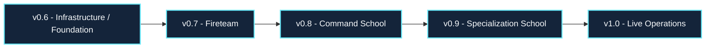
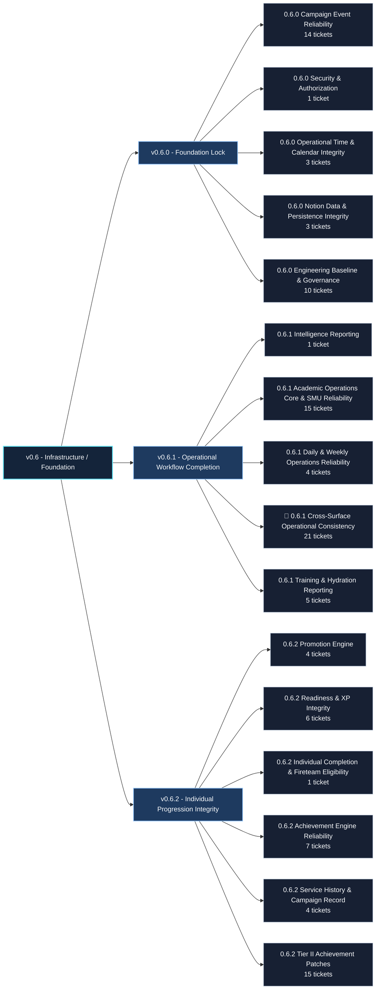
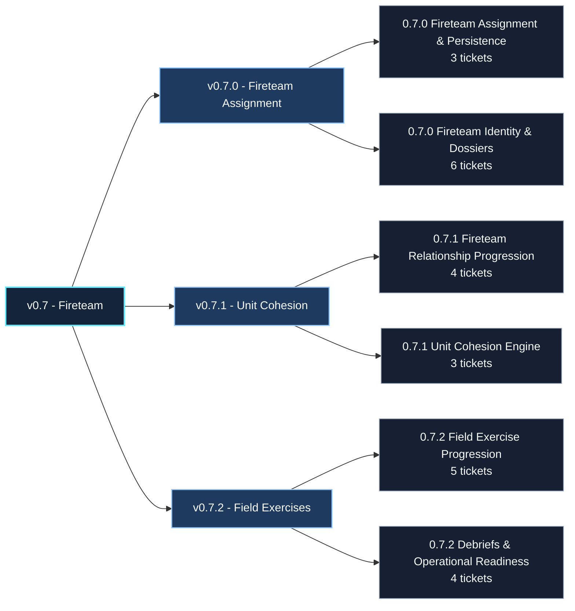
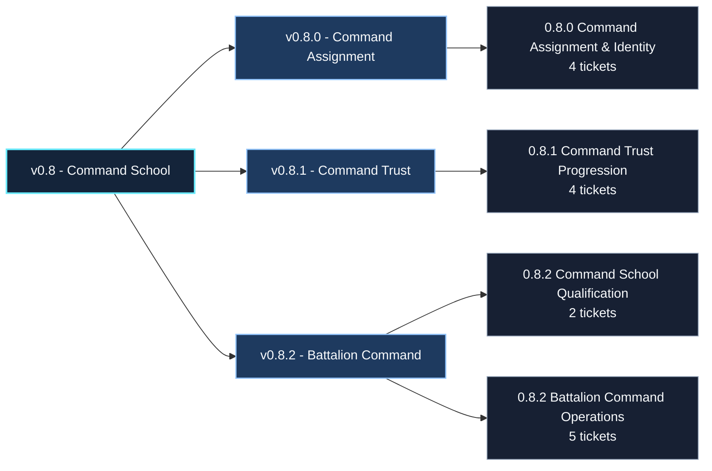
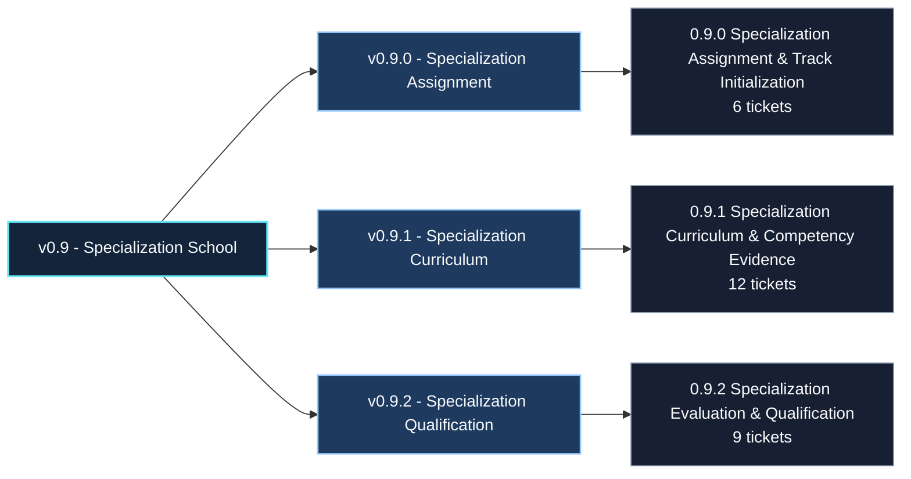
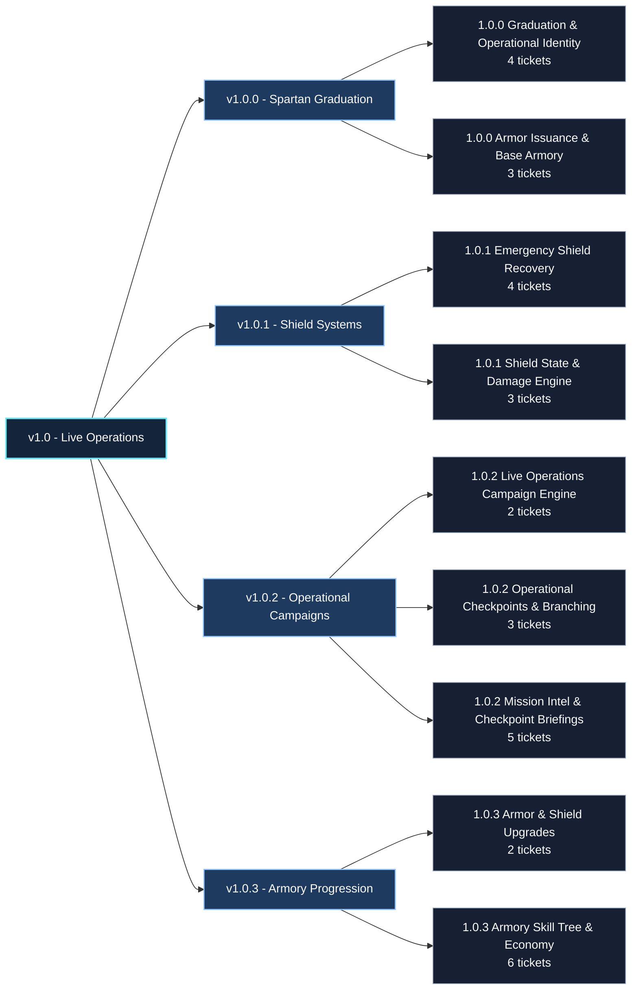

# Product Architecture Map

**Document status:** Living planning map  
**Last verified:** 2026-07-16
**Scope:** Milestone, release, and epic names, their approved planning relationships, and direct SDCB ticket counts

This is the first, repository-native version of the Product Architecture Map (PAM). It visualizes planning structure only; it does not claim that planned functionality is implemented. Ticket counts are point-in-time totals of the SDCB records directly linked through each epic's `Epic` relation. [`SYSTEM_STATUS.md`](SYSTEM_STATUS.md) remains authoritative for implementation status, and the Spartan Dev Command Board remains authoritative for live execution status and current counts.

## Milestone sequence

## v0.6 - Infrastructure / Foundation

## v0.7 - Fireteam

## v0.8 - Command School

## v0.9 - Specialization School

## v1.0 - Live Operations

## Sources

- [`ROADMAP.md`](ROADMAP.md) — approved milestone and release architecture.
- [`ADR-0004`](adr/0004-progression-engine-roadmap-structure.md) — planning hierarchy and canonical milestone sequence.
- Release Operations and the Spartan Dev Command Board — names, parent relations, and direct epic ticket counts verified on 2026-07-16.
